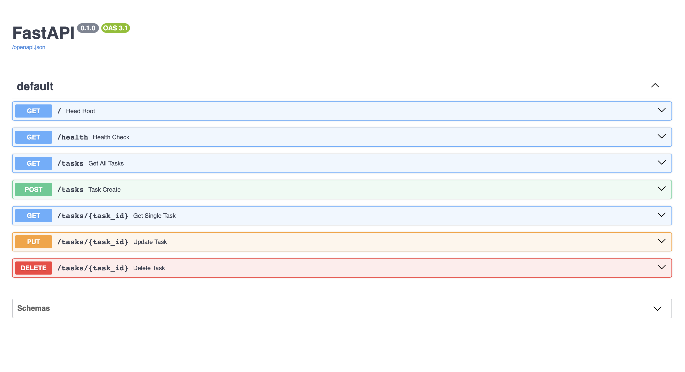

# FlyRank Internship - To-Do CRUD API

This is a small RESTful API that manages a to-do list built with Python and FastAPI. Data is stored in-memory.

## How to Run

1. Install dependencies: `pip install fastapi uvicorn pydantic`
2. Start the server: `uvicorn main:app --reload`
3. The API will be available at `http://localhost:8000`

## Endpoints

| HTTP Method | Path | Description |
|---|---|---|
| GET | `/` | API Root info |
| GET | `/health` | Health Check |
| GET | `/tasks` | List all tasks |
| GET | `/tasks/{task_id}` | Get single task |
| POST | `/tasks` | Create a new task |
| PUT | `/tasks/{task_id}` | Update a task |
| DELETE | `/tasks/{task_id}`| Delete a task |

## Example Request & Response

Creating a new task using curl:
```bash
curl -i -X POST http://localhost:8000/tasks -H "Content-Type: application/json" -d '{"title":"Buy milk"}'
```

```http
HTTP/1.1 201 Created
date: Thu, 16 Jul 2026 17:52:41 GMT
server: uvicorn
content-length: 40
content-type: application/json
{"id":1,"title":"Buy milk","done":false}
```

