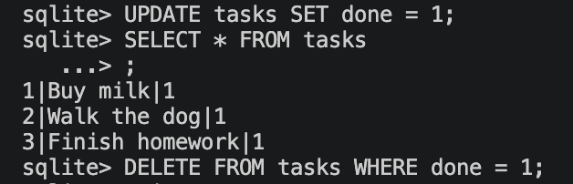
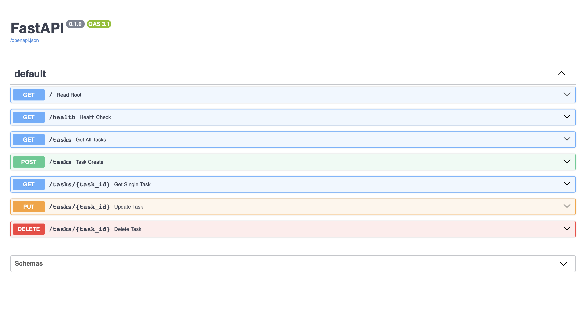
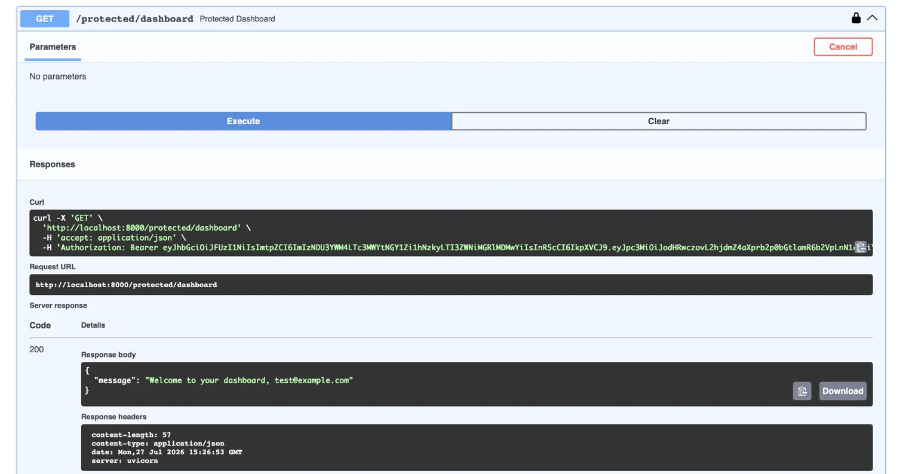

# FlyRank Internship - To-Do CRUD API

This is a RESTful API that manages a to-do list built with Python and FastAPI. 
**Update (Stage A2):** The data storage has been migrated from an in-memory list to a persistent PostgreSQL database running in Docker.

## 🚀 How to Run (Docker)

The entire stack (the FastAPI application and the PostgreSQL database) is containerized.

1. Create your environment file from the provided example:
   ```bash
   cp .env.example .env
   ```
2. Start the application and database together:
   ```bash
   docker compose up -d
   ```
3. The API will be available at `http://localhost:8000`
4. Interactive Swagger UI is at `http://localhost:8000/docs`

## 🏗️ Architecture & Database Migration

* **Service and Routes Unchanged:** A new PostgreSQL repository (`repository.py`) was written to handle all SQL queries. It implements the exact same interface as the old in-memory store. Because of this clean separation, **the service and routes in `main.py` remained completely unchanged.**
* **Environment Variables:** The database connection string is securely loaded from the `.env` file (which is gitignored). A `.env.example` file is committed to the repo to show the expected format.

## 💾 Proof of Persistence

The PostgreSQL database runs inside a Docker container with a configured **named volume** (`pgdata`). Persistence was verified with the following steps:
1. Started the stack with `docker compose up -d`.
2. Created a new task via `POST /tasks`:
   ```bash
   curl -X POST http://localhost:8000/tasks -H "Content-Type: application/json" -d '{"title":"Persistence Test"}'
   ```
3. Destroyed the running containers using `docker compose down`.
4. Restarted the stack with `docker compose up -d`.
5. Sent a `GET /tasks` request and confirmed the task was still there, proving the volume successfully persisted the data.

---
---

## SQLite Version (Assignment W3·A1)

As a separate exercise, this project was also connected to a lightweight **SQLite**
database, kept alongside the PostgreSQL version rather than replacing it. This proves
the same architectural point twice, with two different databases: the storage layer
can change completely without touching the API.

### Why SQLite for this exercise

This project is small and single-user, not a big, concurrent, multi-service system —
SQLite is a simpler fit for that scale than running a full Postgres server in Docker.
It requires no server process and no container at all: it's a single file, and Python's
standard library can talk to it directly.

### Where the database lives

The database is a single file, `tasks.db`, created automatically in the project's root
folder (`crud-api/`) the first time the app runs. It didn't exist before that — no setup
step is needed to create it.

### How to run it

```bash
cd crud-api
source .venv/bin/activate
uvicorn main:app --reload
```

`tasks.db` is created automatically, the `tasks` table is created if it doesn't exist,
and three example tasks are inserted only the first time the table is empty.

### Architecture: same interface, new implementation

Just like the PostgreSQL migration, the SQLite version implements the exact same
repository interface (`get_all`, `get_by_id`, `create`, `update`, `delete`) as an
in-memory store or a Postgres store would — the file is `repository_sqlite.py`, and
`main.py` only had to change one import line to switch to it:

```python
import repository_sqlite as repository
```

No route, no service logic, and no status code handling changed to make this work.

### Proof of Persistence

1. Started the app with `uvicorn main:app --reload`.
2. Created tasks via `POST /tasks` through Swagger UI.
3. Stopped the server completely (`Ctrl+C`), then restarted it (`uvicorn main:app`).
4. Sent `GET /tasks` and confirmed the previously created tasks were still there —
   proof that SQLite persisted the data across a full restart, not just a `--reload`.

### Exploring the database manually

Opened the database directly from the terminal:

```bash
sqlite3 tasks.db
```

Ran several queries by hand and confirmed the API reflected each change immediately
afterward. The most instructive one was:

```sql
UPDATE tasks SET done = 1;
```

Running this manually marked every task as done directly in the database — no code,
no API call — and the very next `GET /tasks` request through the API immediately
returned every task with `"done": true`. That's the clearest demonstration in this
whole exercise that the API has no memory of its own: it only ever reflects whatever
is actually in the database at the moment it's asked.


## Endpoints

| HTTP Method | Path | Description |
|---|---|---|
| GET | `/` | API Root info |
| GET | `/health` | Health Check |
| GET | `/tasks` | List all tasks |
| GET | `/tasks/{task_id}` | Get single task |
| POST | `/tasks` | Create a new task |
| PUT | `/tasks/{task_id}` | Update a task |
| DELETE | `/tasks/{task_id}`| Delete a task |

## Example Request & Response

Creating a new task using curl:
```bash
curl -i -X POST http://localhost:8000/tasks -H "Content-Type: application/json" -d '{"title":"Buy milk"}'
```

```http
HTTP/1.1 201 Created
date: Thu, 16 Jul 2026 17:52:41 GMT
server: uvicorn
content-length: 40
content-type: application/json

{"id":1,"title":"Buy milk","done":false}
```



---

## AI vs Me

### My Prompt

Using Python FastAPI: GET("/"), GET("/health"), GET("/tasks"), GET /tasks/{task_id}
returns 200 normally, but raises 404 if the task is not found (using HTTPException).
POST("/tasks", status_code=201). PUT /tasks/{task_id} returns 200 normally, raises 404
if the title is empty or if the task is not found. DELETE("/tasks/{task_id}",
status_code=204), raises 404 if the task is not found. No database — in-memory storage
only. Uses Swagger UI.

### What did the AI do better — and do I understand its version well enough to explain it?

The AI added a `response_model` parameter to every endpoint (e.g. `response_model=Task`,
`response_model=List[Task]`). This tells FastAPI exactly what shape each response must
have, and FastAPI validates the outgoing data against it automatically. In a small project
like this it isn't strictly necessary — my plain `dict` responses work fine — but in a
larger codebase or a team setting, `response_model` catches shape mismatches early and
makes the Swagger docs more precise. I understand why it's there and could explain it,
even though I didn't use it myself.

### What did it get wrong or quietly ignore from my prompt?

My prompt told it to return 404 when the title is empty in `PUT /tasks/{task_id}` — but
that's actually a request validation error, which should be 400, not 404 (400 means "the
data you sent is invalid," 404 means "the resource you're asking for doesn't exist"). I
made this mistake in my own prompt because I copied an earlier bug from my own code
without re-checking it. The AI didn't correct me — it implemented exactly what I asked
for, and even left a comment flagging it: `# Normally this would be a 400 Bad Request,
but implemented as 404 per your instructions`. It didn't push back or fix my mistake; it
just followed the specification as given, which is exactly the lesson this stage is
about — an AI's output is only as good as what you specify.

### What did my prompt forget to specify — and what did the AI silently decide for you?

I never mentioned `response_model`, `List`, or `Optional` at all — the AI added these on
its own. It also added a `description` field to the `Task` model that I never asked for,
and used a `dict` keyed by `task_id` (`tasks_db = {}`) instead of the list I used
(`task_db = []`). These are reasonable default decisions, but they were entirely the
AI's own choices, made silently because my prompt didn't constrain the internal data
structure — only the endpoints and status codes.

### One-sentence takeaway after the rematch

If I rewrote the prompt, I'd fix my own PUT/title status code mistake (400, not 404) and
explicitly state the data structure (a list vs a dict) so the AI's internal implementation
choices matched mine more closely.


---

## Authentication (Assignment W2·A4)

This project now includes a full authentication system built with **Supabase Auth** as
the Identity Provider. No passwords are stored or hashed by this application — Supabase
handles that entirely; this API only ever sends credentials to Supabase and verifies the
tokens it hands back.

### Setup

1. Create a free project at [supabase.com](https://supabase.com).
2. In your Supabase Dashboard, go to **Project Settings → API** and copy your **Project
   URL** and **anon key** (never the `service_role` key).
3. Add them to your `.env` file (see `.env.example` for the expected format):
   ```
   SUPABASE_URL=your_project_url
   SUPABASE_KEY=your_anon_key
   ```
4. In **Authentication → Providers → Email**, turn off "Confirm email" for local testing
   (in production this should stay on).
5. Run the server:
   ```bash
   source .venv/bin/activate
   uvicorn flyrank:app --reload
   ```

### Endpoints

| Method | Path | Auth required | Description |
|---|---|---|---|
| POST | `/auth/signup` | None | Create a new user account |
| POST | `/auth/login` | None | Authenticate and receive a JWT access token |
| POST | `/auth/logout` | Bearer token | End the current session |
| GET | `/protected/profile` | Bearer token | Read the authenticated user's profile |
| GET | `/protected/dashboard` | Bearer token | Second protected route, reusing the same guard |
| GET | `/public/info` | None | Open, unauthenticated data |

### Architecture: one reusable guard

Token verification lives in a single dependency function, `get_current_user`, built on
FastAPI's `HTTPBearer` security scheme. Every protected route takes this dependency as a
parameter instead of repeating auth logic — adding a new protected route (like
`/protected/dashboard`) required zero new authentication code, only reusing the existing
guard.

### Proof it actually verifies tokens

- A request to a protected route with **no token** → `401 Access token required`.
- A request with a **malformed or invalid token** (e.g. a random string) → `401 Invalid
  or expired token`.
- A request with a **valid JWT from a real login** → `200`, with the real user's data.

### Swagger UI

`/docs` now shows a lock icon next to every protected route, and an "Authorize" button
that accepts a bearer token once and reuses it across all protected endpoints.


